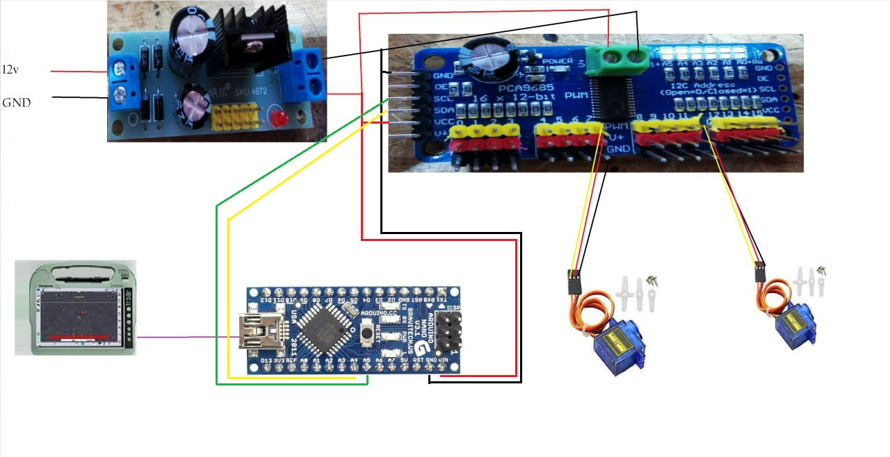

# AOGMatic

Aogmatic (DIY) pour le controle des sections avec des Servomoteurs via AgopenGps. Les models 3D présenté ici sont pour une utilisation avec un boitier HardySprayII ou EvrardEC2500.
Mais le code pourrais très bien servir à bien d'autre boitier ou autre utilisation.

# Hardware

Nous utilisons ici: Un arduino Nano, Un régulateur 5V, Une plaquette controle de relais de servomoteurs PCA9685, des servomoteurs SG90.

Schéma de branchement:

Liens des fichiers 3D:
A venir...

Vidéo d'explication du montage des pièces 3D:
https://www.youtube.com/watch?v=GPidbl-RtbM

